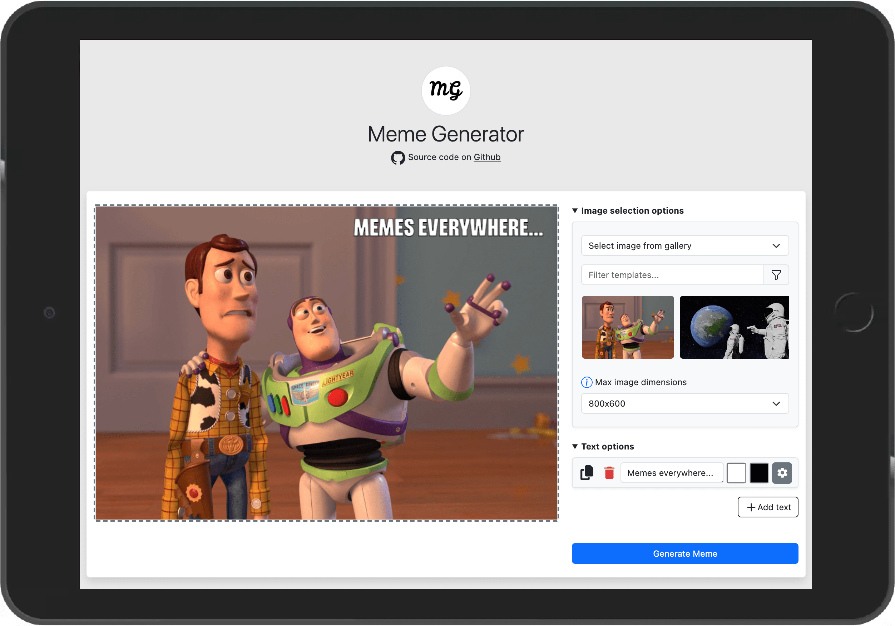

<p align="center">
  
</p>

<h1 align="center">Meme Generator</h1>

A Progressive Web App (PWA) for creating memes.

The application is built with web technologies such as HTML, CSS, and JavaScript. It uses the [Canvas API](https://developer.mozilla.org/docs/Web/API/Canvas_API) to draw the meme text on the image. Processing the image and text is done client-side, so no data is sent to any server.

## Features

Create a meme with by:
- Selecting an image from your device
- Selecting an image from the web (by URL)
- Selecting an image from the gallery
- Taking a photo with your device's web camera
- Using a solid color as background

## Screenshots



## Development

Below are the instructions for setting up the development environment.

### Prerequisites

- Node.js (v20.x.x)
- npm (v10.x.x)

### Installation

1. Clone the repository

```bash
git clone git@github.com:georapbox/meme-generator.git
```

2. Navigate to the project directory

```bash
cd meme-generator
```

3. Install dependencies

```bash
npm install
```

4. Start the development server

```bash
npm start
```

5. Open your browser and navigate to `http://localhost:1234`

## Deployment

To build the app for production, run:

```bash
npm run build
```

This will generate the production build in the `docs` directory. The reason that the build is in the `docs` directory is to enable GitHub Pages to serve the app. 

## License

[The MIT License (MIT)](https://georapbox.mit-license.org/@2019)
